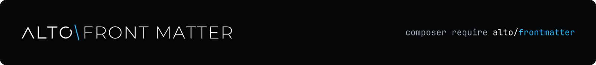

<h1 align="center">
  <a href="https://altophp.com/frontmatter">
    
  </a>
</h1>

Fast front matter extraction and strict YAML-subset decoding for PHP.

<p align="center">
  
  
  <a href="https://packagist.org/packages/alto/frontmatter"></a>
  
  <a href="https://github.com/sponsors/smnandre"></a>
</p>

ALTO Front Matter reads the fenced metadata block at the top of a document and
returns a typed, read-only accessor. It has no runtime Composer dependencies,
does not retain the document body, and rejects unsupported YAML instead of
silently reinterpreting it.

```php
use Alto\FrontMatter\FrontMatter;

$metadata = FrontMatter::fromString($document);

$title = $metadata->getString('title');
$draft = $metadata->getBoolean('draft', false);
$tags = $metadata->all('tags');
```

The decoder follows the YAML 1.2 core schema over a deliberately strict subset.
Its parser is single-pass, reports the first syntax error with a line and
column, and is covered by a 100% line-coverage quality gate.

## Installation

Install ALTO Front Matter with Composer:

```bash
composer require alto/frontmatter
```

ALTO Front Matter requires PHP 8.4 or later and has no runtime PHP extension or
Composer package requirements.

## Quick Start

```php
use Alto\FrontMatter\FrontMatter;

$document = <<<'MARKDOWN'
---
title: Hello World
draft: false
tags: [php, alto]
---
# Hello World
MARKDOWN;

$metadata = FrontMatter::fromString($document);

echo $metadata->getString('title');
$body = substr($document, $metadata->sourceOffset() + $metadata->sourceLength());
```

`fromString()` returns empty metadata when the document has no front matter and
throws when a detected block is malformed. Use `fromFile()` when the package
should read the file for you.

## Documentation

| Guide | Contents |
| --- | --- |
| [Documentation index](docs/index.md) | Browse the complete guide set |
| [Installation](docs/installation.md) | Install the package and check requirements |
| [Getting started](docs/getting-started.md) | Read metadata and locate the body |
| [Typed metadata](docs/metadata.md) | Accessors, defaults, enums, and dates |
| [Decoding](docs/decoding.md) | The supported YAML subset and raw blocks |
| [Rendering](docs/rendering.md) | Generate YAML, JSON, and TOML front matter |
| [Integration](docs/integration.md) | Decoder and renderer contracts |
| [Errors](docs/errors.md) | Exception hierarchy and recovery |

## Contributing

Contributions of all kinds are welcome. Visit the
[project on GitHub](https://github.com/altophp/frontmatter) to
[report a bug](https://github.com/altophp/frontmatter/issues/new),
[suggest a feature](https://github.com/altophp/frontmatter/issues/new), or
[open a pull request](https://github.com/altophp/frontmatter/pulls).

Before submitting code, run:

```bash
# Runs PHP CS Fixer, PHPStan, and PHPUnit
composer qa
```

Changes to public behavior should include tests and documentation.

Run `composer coverage` separately to enforce the 100% line-coverage floor.

## Support

ALTO Front Matter is open source and independently maintained by
[Simon André](https://smnandre.dev). If it is useful to your work, you can
support its continued development through
[GitHub Sponsors](https://github.com/sponsors/smnandre).

Sharing the package or
[starring it on GitHub](https://github.com/altophp/frontmatter) also helps.

## License

ALTO Front Matter is released by [ALTO PHP](https://altophp.com) under the
[MIT License](LICENSE).
